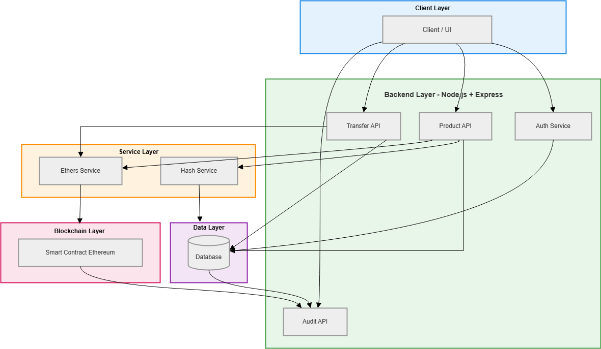

# Blockchain based Supply Chain Management System 

## 🚀 Overview

This project implements a blockchain-based supply chain tracking system to ensure transparency and traceability from manufacturer to retailer.

## 🏗️ System Architecture

### 🔍 Architecture Explanation

The system follows a layered architecture combining traditional backend systems with blockchain for trust and immutability.

#### 🔵 Client Layer
- Users interact through UI or Postman.
- Sends requests like product creation, transfer, and audit.

#### 🟢 Backend Layer (Node.js + Express)
- Handles core business logic.
- Includes:
  - Auth Service (authentication & authorization)
  - Product API (product creation & management)
  - Transfer API (ownership transfer)
  - Audit API (verification & tracking)

#### 🟠 Service Layer
- Abstracts external logic:
  - **Hash Service** → generates product hash for integrity
  - **Ethers Service** → interacts with blockchain

#### 🟣 Data Layer
- Stores high-volume mutable data (users, products, transfers)
- Ensures fast reads/writes and scalability

#### 🔴 Blockchain Layer
- Smart contract stores:
  - Product hash
  - Ownership changes
- Provides immutability and audit trail

---

### 🔄 Data Flow Summary

1. User creates product → stored in DB + hash generated  
2. Hash is registered on blockchain  
3. Ownership transfer updates DB + blockchain  
4. Audit API verifies data using both DB and blockchain  

---

### ⚖️ Design Decision 

- **Off-chain (DB):** Fast, scalable operations  
- **On-chain (Blockchain):** Immutable proof & trust  

This hybrid design balances performance and security.

## 🛠️ Tech Stack

- **Backend:** Node.js / Express
- **Blockchain:** Hardhat + `SupplyChainRegistry` (`blockchain/`) — compile, test, deploy locally
- **Database:** MongoDB (Mongoose) — schemas in `backend/src/models/`

## 📌 Current Status
 backend foundation is completed:
- Express app setup (`backend/src/app.js`)
- MongoDB connector (`backend/src/config/db.js`)
- Health endpoint (`GET /health`)
- Authentication stack added :
  - `POST /api/auth/register`
  - `POST /api/auth/login`
  - `GET /api/auth/me` (Bearer token)
  - JWT + role-based middleware
- Product API added :
  - `POST /api/products` (manufacturer/admin only, generates `contentHash`)
  - `GET /api/products`
  - `GET /api/products/:id`
- Ownership transfer API added :
  - `POST /api/transfers` (validates current owner, updates owner, records transfer)
  - `GET /api/transfers/product/:productId` (transfer history)
- Smart contract design :
  - `blockchain/contracts/SupplyChainRegistry.sol` — structs, mappings, events (`ProductRegistered`, `OwnershipTransferred`)
- Hardhat :
  - `cd blockchain` → `npm install` → `npm run compile` → `npm test`
  - Local deploy: `npm run node` then `npm run deploy:local`

Project is under development.
