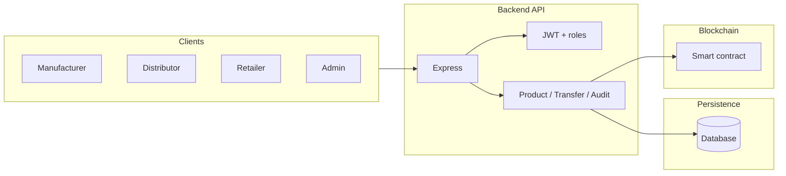

# Architecture

## High-level view

## Data flow (target state)

1. **Authentication** — Users register/login; JWT encodes role (manufacturer, distributor, retailer, admin).
2. **Products** — Create product in DB with content hash; optionally anchor on-chain and store transaction hash.
3. **Transfers** — Validate current owner, update ownership in DB, record transfer history; mirror critical steps on-chain.
4. **Audit** — Merge DB records with on-chain events and re-verify hashes.

## Role responsibilities (conceptual)

| Role          | Typical actions                          |
|---------------|------------------------------------------|
| Manufacturer  | Create/register products                 |
| Distributor   | Receive and forward ownership            |
| Retailer      | Final leg to consumer-facing inventory   |
| Admin         | Oversight, configuration (as designed)   |

