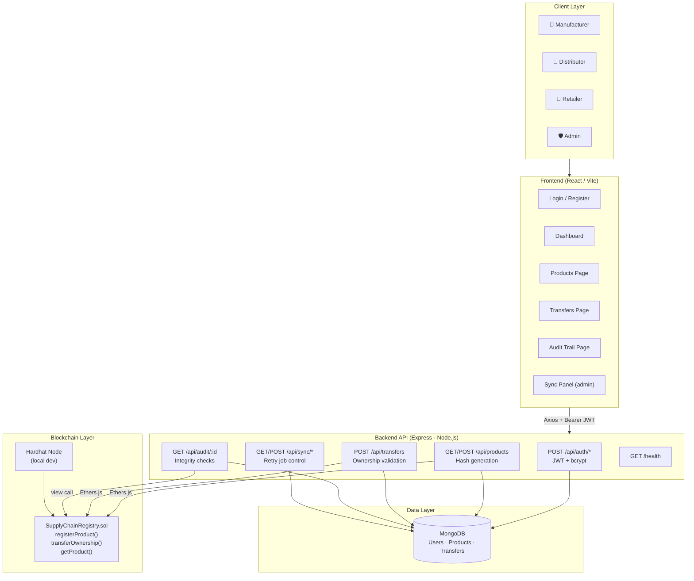
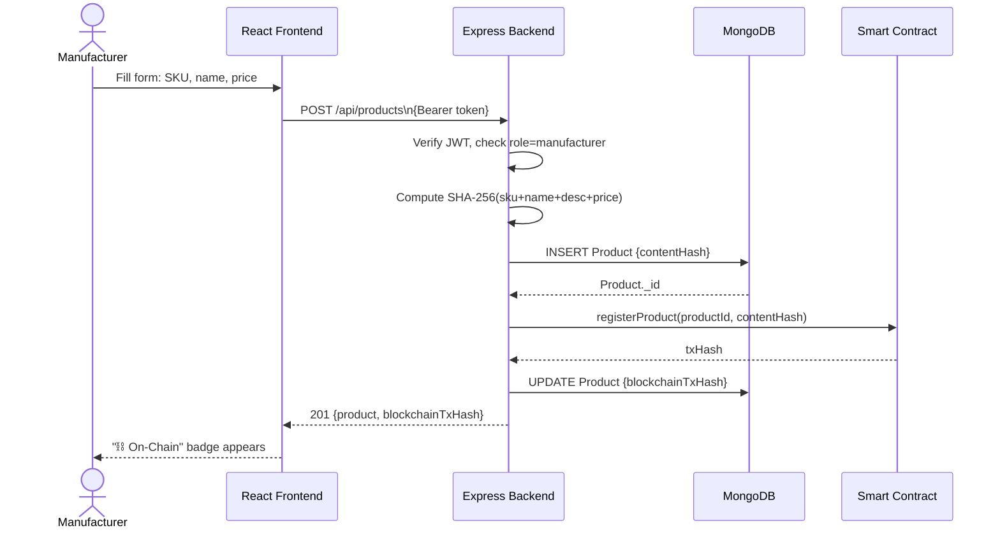
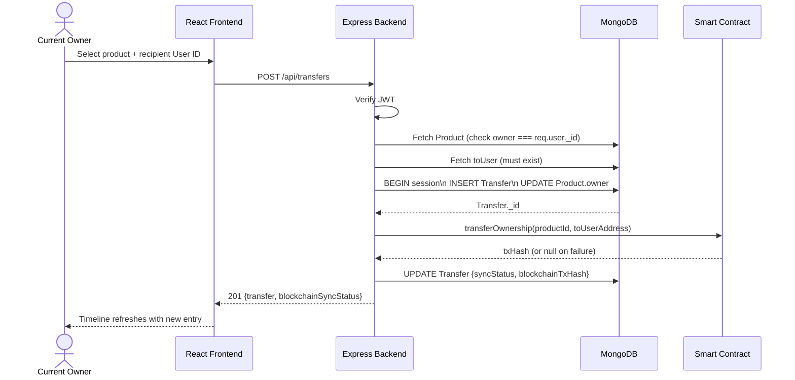
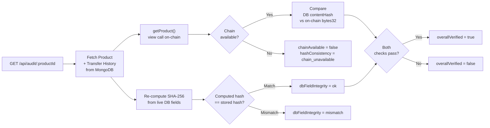
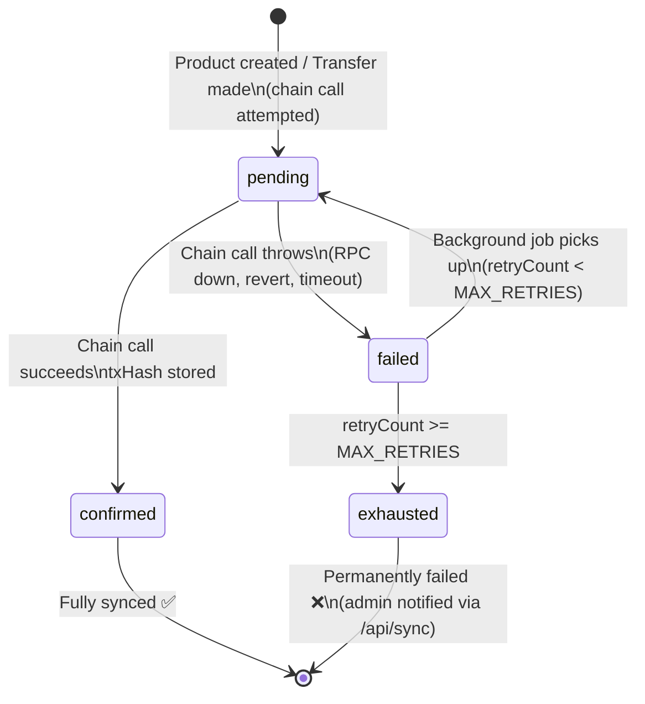

# BlockTrace — Architecture

## 1 · High-Level System Diagram


```mermaid
flowchart TB
  subgraph CLIENT ["Client Layer"]
    direction LR
    M["👷 Manufacturer"]
    D["🚛 Distributor"]
    R["🏪 Retailer"]
    A["🛡 Admin"]
  end

  subgraph FRONTEND ["Frontend (React / Vite)"]
    direction LR
    UI_AUTH["Login / Register"]
    UI_DASH["Dashboard"]
    UI_PROD["Products Page"]
    UI_TRANS["Transfers Page"]
    UI_AUDIT["Audit Trail Page"]
    UI_SYNC["Sync Panel (admin)"]
  end

  subgraph BACKEND ["Backend API (Express · Node.js)"]
    direction LR
    AUTH["POST /api/auth/*\nJWT + bcrypt"]
    PROD_API["GET/POST /api/products\nHash generation"]
    TRANS_API["POST /api/transfers\nOwnership validation"]
    AUDIT_API["GET /api/audit/:id\nIntegrity checks"]
    SYNC_API["GET/POST /api/sync/*\nRetry job control"]
    HEALTH["GET /health"]
  end

  subgraph DATA ["Data Layer"]
    DB[("MongoDB\nUsers · Products · Transfers")]
  end

  subgraph CHAIN ["Blockchain Layer"]
    HC["Hardhat Node\n(local dev)"]
    SC["SupplyChainRegistry.sol\nregisterProduct()\ntransferOwnership()\ngetProduct()"]
  end

  CLIENT --> FRONTEND
  FRONTEND -->|"Axios + Bearer JWT"| BACKEND
  AUTH --> DB
  PROD_API --> DB
  PROD_API -->|"Ethers.js"| SC
  TRANS_API --> DB
  TRANS_API -->|"Ethers.js"| SC
  AUDIT_API --> DB
  AUDIT_API -->|"view call"| SC
  SYNC_API --> DB
  HC --> SC
```

---

## 2 · Request Flow — Product Registration


```mermaid
sequenceDiagram
  actor MFR as Manufacturer
  participant FE as React Frontend
  participant API as Express Backend
  participant DB as MongoDB
  participant BC as Smart Contract

  MFR->>FE: Fill form: SKU, name, price
  FE->>API: POST /api/products\n{Bearer token}
  API->>API: Verify JWT, check role=manufacturer
  API->>API: Compute SHA-256(sku+name+desc+price)
  API->>DB: INSERT Product {contentHash}
  DB-->>API: Product._id
  API->>BC: registerProduct(productId, contentHash)
  BC-->>API: txHash
  API->>DB: UPDATE Product {blockchainTxHash}
  API-->>FE: 201 {product, blockchainTxHash}
  FE-->>MFR: "⛓ On-Chain" badge appears
```

---

## 3 · Request Flow — Ownership Transfer


```mermaid
sequenceDiagram
  actor OWN as Current Owner
  participant FE as React Frontend
  participant API as Express Backend
  participant DB as MongoDB
  participant BC as Smart Contract

  OWN->>FE: Select product + recipient User ID
  FE->>API: POST /api/transfers
  API->>API: Verify JWT
  API->>DB: Fetch Product (check owner === req.user._id)
  API->>DB: Fetch toUser (must exist)
  API->>DB: BEGIN session\n  INSERT Transfer\n  UPDATE Product.owner
  DB-->>API: Transfer._id
  API->>BC: transferOwnership(productId, toUserAddress)
  BC-->>API: txHash (or null on failure)
  API->>DB: UPDATE Transfer {syncStatus, blockchainTxHash}
  API-->>FE: 201 {transfer, blockchainSyncStatus}
  FE-->>OWN: Timeline refreshes with new entry
```

---

## 4 · Audit Verification Flow


```mermaid
flowchart LR
  REQ["GET /api/audit/:productId"] --> FETCH_DB["Fetch Product\n+ Transfer History\nfrom MongoDB"]
  FETCH_DB --> FETCH_CHAIN["getProduct()\nview call on-chain"]

  FETCH_CHAIN --> CHECK1{"Chain\navailable?"}
  CHECK1 -->|Yes| HASH_CMP["Compare\nDB contentHash\nvs on-chain bytes32"]
  CHECK1 -->|No| UNAVAIL["chainAvailable = false\nhashConsistency = chain_unavailable"]

  FETCH_DB --> CHECK2["Re-compute SHA-256\nfrom live DB fields"]
  CHECK2 --> FIELD_CMP{"Computed hash\n== stored hash?"}
  FIELD_CMP -->|Match| DB_OK["dbFieldIntegrity = ok"]
  FIELD_CMP -->|Mismatch| DB_FAIL["dbFieldIntegrity = mismatch"]

  HASH_CMP --> BOTH{"Both\nchecks pass?"}
  DB_OK --> BOTH
  BOTH -->|Yes| VERIFIED["overallVerified = true"]
  BOTH -->|No| FAILED["overallVerified = false"]
```

---

## 5 · Blockchain Sync & Retry Flow


```mermaid
stateDiagram-v2
  [*] --> pending: Product created / Transfer made\n(chain call attempted)

  pending --> confirmed: Chain call succeeds\ntxHash stored
  pending --> failed: Chain call throws\n(RPC down, revert, timeout)

  failed --> pending: Background job picks up\n(retryCount < MAX_RETRIES)
  failed --> exhausted: retryCount >= MAX_RETRIES

  confirmed --> [*]: Fully synced ✅
  exhausted --> [*]: Permanently failed ❌\n(admin notified via /api/sync)
```

---

## 6 · Role Responsibilities

| Role | Create Product | Transfer | Audit | Sync Admin |
|------|:--------------:|:--------:|:-----:|:----------:|
| Manufacturer | ✅ | ✅ (if owner) | ✅ | ❌ |
| Distributor | ❌ | ✅ (if owner) | ✅ | ❌ |
| Retailer | ❌ | ✅ (if owner) | ✅ | ❌ |
| Admin | ✅ | ✅ | ✅ | ✅ |

---

## 7 · Frontend Page Map

```
/login          → LoginPage.jsx      (public)
/register       → RegisterPage.jsx   (public)
/               → DashboardPage.jsx  (protected — role-aware hero)
/products       → ProductsPage.jsx   (protected — create form for mfr/admin)
/transfers      → TransfersPage.jsx  (protected — initiate form + timeline)
/audit          → AuditPage.jsx      (protected — search + integrity report)
/sync           → SyncPage.jsx       (protected — counters + admin controls)
```
